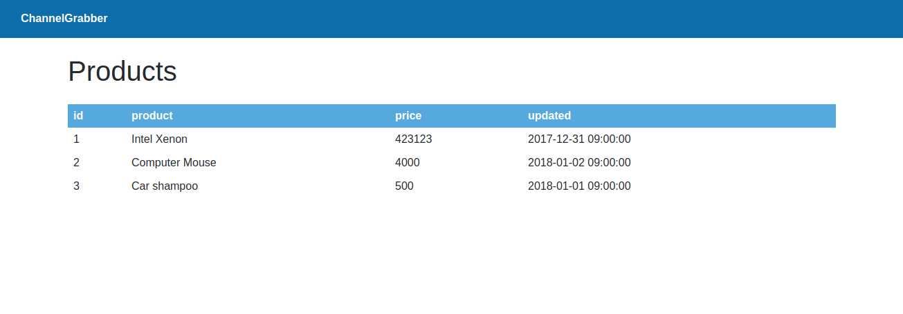

#ChannelGrabber frontend tech test
Time to show off some of your frontend skills. We've built this tech test using React, we're not expecting every candidate to be a react expert but hopefully, with our guidance in this readme, you should be able to pick up the React aspects quite quickly. We won't penalise you for not using React best practices as long as you can show a good handle of JavaScript.

#Tech test architecture
We've got a PHP application (Slim framework) to render the initial web page and act as the API and serve data to the frontend; this isn't too dissimilar from our production setup at ChannelGrabber.

To compliment that, we have a basic React application to display the data to the user in a nice friendly UI.

We're using Sass to generate CSS

#Requirements
- PHP 5.5 or greater
- composer https://getcomposer.org/download/
- node JS https://nodejs.org/en/
- yarn https://yarnpkg.com/en/docs/install

We operate on a linux environment, but if you're using windows you may find the [following instructions useful for installing PHP/composer](http://kizu514.com/blog/install-php7-and-composer-on-windows-10/)

If you're having problems installing any of these, please get in touch and we can help you out.

#Building the App
`composer install` install all of the required PHP packages

`yarn install` install all of the required node_modules

`yarn build` this should build the JavaScript application and start the PHP webserver

`cd public`

`php -S localhost:8081`  Starts the built in web server

You should now be able to navigate to <http://localhost:8081>

#Useful commands
`composer run-script export-app`
This will export the app as a zip file for submission

`yarn run watch`
This will re-compile your code every time you make a change in the ReactApp/src folder

#What we're looking for
We're aware that not everybody is familiar with React, but we're hoping your an experienced JavaScript developer and can adapt to a React environment. We'll be looking for correct implementation of the feature requests, followed by best JavaScript practices and then the icing on the cake should be best React practices.

#A bit about React
React pitches itself as the "View" in MVC and nothing else. As such React is essentially just a way of managing your UI components and interactions between them.

All of the React code in this Application is in `./ReactApp/src`

#Technical Tasks

## Warming up
- Edit the data source to add another product to the table

- The price of the product is stored as an integer, reflecting the value in pence, but this doesn't make much sense to the customer. Add a function on the ProductsTable component to format the price in £. For example the Car Shampoo would be £5.00. Do not edit the raw data.

- We decide that we may want to use the code you've written in the previous step somewhere else, move this to a utils class or function which is separate to the ProductsTable component and have the ProductsTable component use the new class or function.

## The challenge
We want the user to be able to sort the columns of the table either Ascending or Descending

- Add an `onClick` handler for the column headers, when clicked, this will arrange the items in the table in ascending order for that given column.

I.E. if I clicked "price", the React app would sort the rows of the table into the following order: 
- Car Shampoo
- Computer Mouse
- Intel Xeon

The product you added in stage 1 should also be appropriately sorted

- Add new functionality to sort the column descending if the user clicks it again.

- Ensure that all columns can be sorted ascending and then descending, by clicking them

#Bonus tasks
If you found the above quite easy or just want to show off, you may wish to try the following:

- We use webpack to build our application, which means we can serve our modular code up as a singular bundle file. The problem is that we're preserving whitespace and this means the output file is fairly large for the amount of code we have. Configure webpack so that it minifies the output.

- We decide that code you wrote for formatting of prices is an important feature. Therefore we need to write some unit tests for it. Import a unit testing framework and write a unit test for it

- Include TypeScript or Flow as part of the build process

- Allow the user to update the price of an item via the UI and save it to the API so that the new price is persisted between page loads